*Данный доклад подготовлен в рамках конференции студенческих клубов разработки "Рандомный день 2026".

## Проблематика
Представьте себе документ, который редактируют несколько человек одновременно. У меня был такой опыт, и я не могу сказать, что он был достаточно приятным. А почему так происходит? Неужели настолько сложно синхронизировать один документ даже между двумя редакторами? Оказывается, да, две конкурентные операции способны привести к совершенно разным результатам. Сегодня я расскажу про то, какие подходы к совместному редактированию текста применялись (и продолжают применяться) в течение последних 20 лет, а также постараюсь уделить внимание тому, на какие неординарные архитектурные решения и компромиссы приходится идти.

## Решения
Так что же делать? Я выделил три ключевых подхода:
1. Наивный
2. Operational Transformation
3. CRDT

## Наивный подход
Все операции над текстом проходят через центрального арбитра, который формирует их общий порядок и применяет операции в соответствии с ним. Все преобразования над итоговым документом происходят только на нём, клиенты лишь получают снапшот, который перезаписывает все локальные изменения.

Очевидно, что это самый примитивный и самый неэффективный вариант, так как снапшот, отправляемый таким арбитром переопределяет все локальные изменения, сам арбитр выступает бутылочным горлышком при большом числе редакторов.

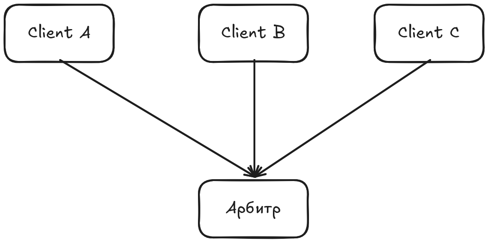

## Operational Transformation
Суть этого подхода заключается в переопределении операции изменения в соответствии с локальным контекстом через функцию трансформации. К примеру, если требуется вставить символ на позицию 1, а вместе с этим изменением конкурентно пришла операция удаления символа на позиции 0, то функция трансформации преобразует операцию вставки, поставив новый символ на позицию 0.

Этот подход позволяет клиентам применять операции локально сразу, устраняя недостатки предыдущего подхода. Однако, проблема в том, что для каждой пары типов операций нужна своя функция трансформации, и доказать её корректность в общем случае оказалось очень тяжело. Существуют два свойства TP1 и TP2, выведенные группой исследователей во главе с Ресселем в рамках алгоритма adOPTed, являющиеся достаточными для обеспечения сходимости копий независимо от порядка применения конкурентных операций.
1. TP1 устанавливает, что результат трансформации не зависит от порядка, в котором пришли конкурентные операции. То есть результат будет одинаков как для цепочки "Пришло O1 -> Пришло O2, применили трансформацию T(O2, O1)", так и для "Пришло O2 -> пришло O1, применили трансформацию T(01, O2)"
2. TP2 устанавливает, что результат трансформации одной операции не зависит от того, через какую цепочку конкурентных операций её трансформировали. В отличие от TP1, где операции O1 и O2 производились на одном и том же контексте (состояния) документа, TP2 постанавливает независимость от различных контекстов, в которых находится операция в цепочке трансформаций.

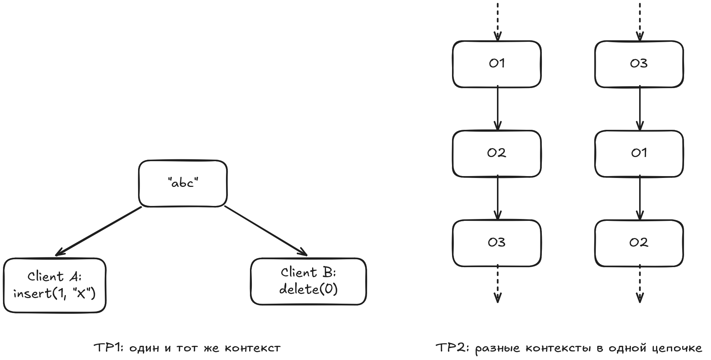

Однако доказать соответствие функции трансформации свойству TP2 оказалось нетривиальной задачей. Рессель смог доказать соответствие своей функции трансформации свойству TP1, но TP2 не поддалось. В течение десяти лет пока одни исследователи предлагали свои варианты таких функций, другие успешно занимались разработкой контрпримеров. В это время реальные системы вроде Google Docs решили не бороться за это доказательство, а обойти задачу архитектурно. Google Docs вводит центральный сервер, единственная задача которого --- установить общий канонический порядок операций. Раз такой порядок один, любая операция трансформируется всегда вдоль ровно одного пути --- того, что задал сервер, а не двух конкурирующих путей, ради согласования которых и нужен TP2. Условие TP2 просто перестаёт быть применимым: предпосылок для его нарушения структурно не возникает. Достаточно, чтобы функции трансформации удовлетворяли куда более слабому TP1.

Схема работы такая: клиент применяет операцию локально сразу же, оптимистично, не дожидаясь сервера, и отправляет её, помечая, на какой версии документа она основана. Сервер трансформирует пришедшую операцию относительно всех операций, накопленных в его истории после этой версии, применяет результат и меняет версию. Автору операции сервер отправляет только подтверждение, а всем остальным клиентам рассылает саму трансформированную операцию. Каждый из них, в свою очередь, трансформирует её относительно своих ещё неподтверждённых локальных правок и применяет результат.

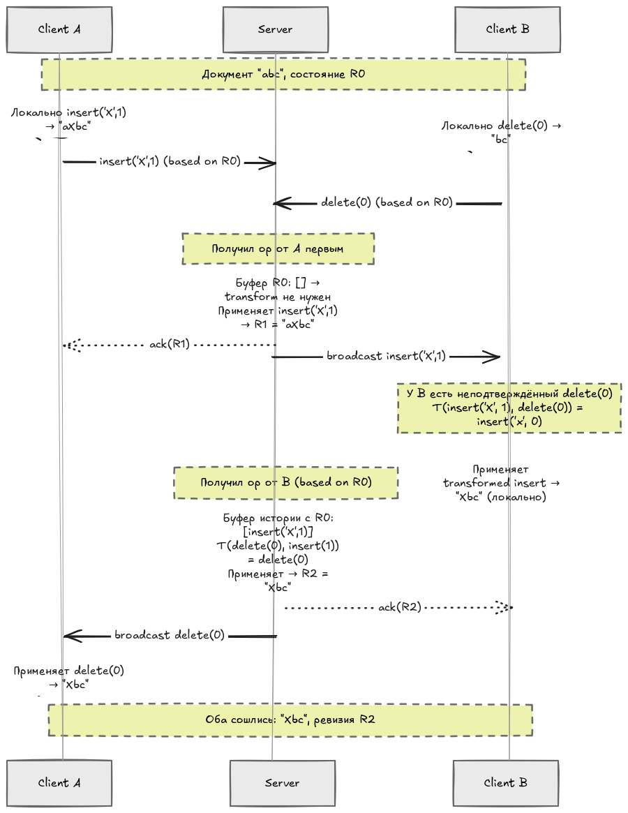

Этот подход — известный как протокол Jupiter и лёгший в основу Google Wave, а затем и Google Docs --- позволил индустрии пользоваться OT ещё за десятилетие до того, как в 2006 году вообще нашли функции трансформации, устраивающие TP2 в общем случае.

Лишь в 2006 году была опубликована работа под названием *"Tombstone transformation functions for ensuring consistency in collaborative edition systems"*, в которой группа исследователей под руководством Геральда Остера смогла формально верифицировать функцию трансформации, удовлетворяющую обеим условиям TP1 и TP2. Это удалось посредством переосмысления самого текста --- вместо представления документа как строки символов, удаление которых полностью стирало информацию о них, было предложено решение хранить "надгробия" (tombstones), которые лишь помечали символ как удалённый, физически оставляя его в структуре. 

## CRDT
Но что, если вообще отказаться от единой точки согласования — избавиться от сервера как арбитра? С этим могут помочь бесконфликтные реплицируемые типы данных (Conflict-free replicated data types, CRDT), архитектурно спроектированные таким образом, чтобы гарантировать схождение двух реплик с одним и тем же множеством увиденных изменений, без внешнего координатора. Порядок операций для таких структур данных не важен, а значит они могут работать автономно и сходиться к единому состоянию, даже если никогда напрямую не общались, а просто в какой-то момент обменялись изменениями.

### WOOT (WithOut Operational Transformation)
В том же 2006 году, в котором спустя десять лет была разрешена проблема свойства TP2, та же группа исследователей публикует статью под названием "Data consistency for P2P collaborative editing", в которой представляют первую CRDT для редактирования текста под названием **WOOT** (WithOut Operational Transformation). Каждый символ представляет из себя структуру под названием W-символ (W-character) со следующим набором параметров:
1. Уникальный ID (его мы разберём подробнее позже)
2. Сам символ
3. ID предыдущего соседа на момент вставки
4. ID следующего соседа на момент вставки
5. Флаг видимости (tombstone)

```rust
  struct CharId {
    ns: u64,    // уникальный идентификатор (обычно UUID)
    ng: u64,    // счётчик
  }  

  struct WChar {
    id: CharId,      // идентификатор символа
    value: char,     // сам символ
    visible: bool,   // tombstone-флаг
    id_prev: CharId, // idcp --- сосед слева на момент вставки
    id_next: CharId, // idcn --- сосед справа на момент вставки
}
```

Структура поддерживает две операции: 
1. `Insert(char, prevID, nextID)` --- создать новый W-символ и разослать его всем.
2. `Delete(id)` --- "удалить", то есть выставить флаг невидимости.

Конфликт разрешается следующим образом: когда локальная реплика получает информацию о вставке нового символа, алгоритм проверяет наличие каких-либо других символов в диапазоне между (prevID, nextID) кандидата на вставку.
- Если пусто, то выполняется вставка.
- Если не пусто (значит другой пользователь конкурентно вставил туда другие символы), то алгоритм рекурсивно сужает диапазон, лексикографически сравнивая ID конкурентно-вставленных символов с ID кандидата пока не найдёт единственно верное место для вставки. 

Так чем же является уникальный идентификатор каждого W-символа? Парой `(ns, ng)`, где `ns` --- это некоторый уникальный идентификатор (обычно UUID), а `ng` --- натуральное число, как правило обозначающее порядковый номер символа, сгенерированным конкретно этим участником сессии редактирования. Так как компонента `ns` является уникальным идентификатором, который генерируется для каждого участника сессии, то пара `(ns, ng)` единственным образом идентифицирует каждый W-символ.

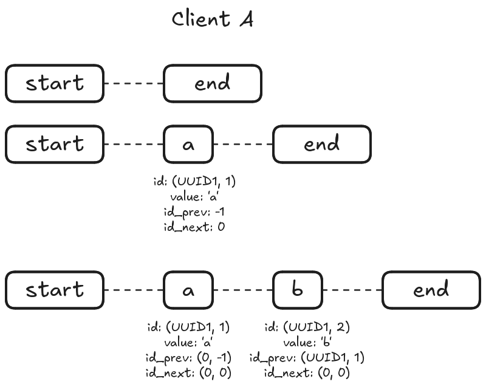
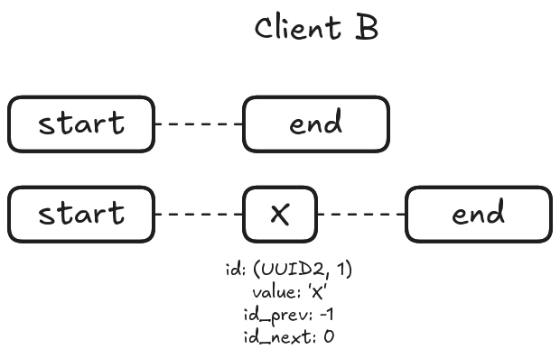
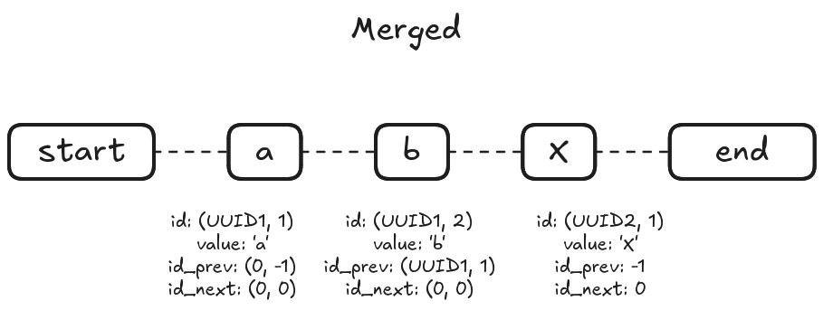

Данное решение стало прорывом в сфере коллаборативного редактирования, так как позволило приводить реплики к единому состоянию без сервера-арбитра и сложных функций трансформации. Но не было оно лишено и недостатков. Архитектурно каждый символ представлял из себя структуру с множеством метаданных, которые занимали намного больше места в памяти, чем стандартный unicode символ. Более того, сами эти структуры из-за tombstone не пропадали при удалении, а оставались навечно внутри документа, из-за чего документы с длинной историей редактирования и большим объёмом самого текста занимали до неприличия много места. А алгоритм разрешения конфликтной вставки требует рекурсивного сканирования по всей области конфликта, что требовало слишком много времени. Кроме того, разрешение конфликта на основе лексикографического сравнения уникальных идентификаторов пользователей не выглядит как решение, которое способно сохранить намерения самого пользователя. 

Несмотря на свои недостатки, WOOT по сей день используется в проекте XWiki Concerto, представляющий собой P2P версию XWiki.

Так в 2006 году началось активное исследование CRDT, направленных на работу с текстом. Это было перспективным направлением, поэтому новые работы не заставили себя долго ждать.

### Logoot
Logoot вышел в 2009 году как ответ на слабости WOOT в виде неограниченного роста tombstone-ов и дорогая рекурсия при конфликтной вставке.

Если WOOT кодирует позицию относительно двух своих соседей, то Logoot предлагает вычисление самодостаточного идентификатора, основанного на своих соседях, но не привязанного к ним. Идентификатор --- это список троек `(i, s, c)`, где `i` --- это числовая позиция символа на данном "уровне", `s` --- site (уникальный идентификатор сессии), `c` --- локальный логический счётчик. Сравнение троек лексикографическое.

Для вставки нового символа, Logoot смотрит на идентификаторы соседей P и Q и арифметически вычисляет свой собственный.
1. В списке троек обоих соседей просматривается один и тот же уровень.
2. Как только находится уровень, где между числовыми `i` есть пространство для вставки (i_Q - i_P > 1) --- выбирается случайное целое число из этого интервала (не строго середина), к которому дописывается `s` и `c` --- формируя собственный идентификатор-тройку
3. Если пространства для вставки нет ни на одном уровне, идентификатор записывает левого "родителя" и удлиняется на один уровень глубже, где место есть всегда.

Кто-то уже догадался, что список идентификаторов представляет собой дерево, каждый новый уровень которого является "приближением" более высокой точности между двумя соседними символами.

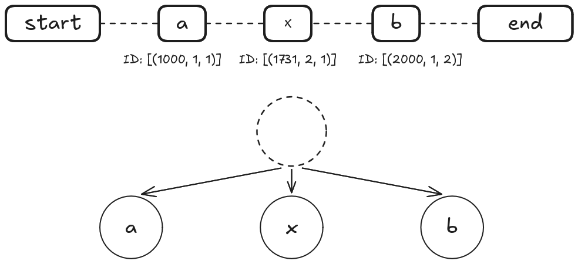
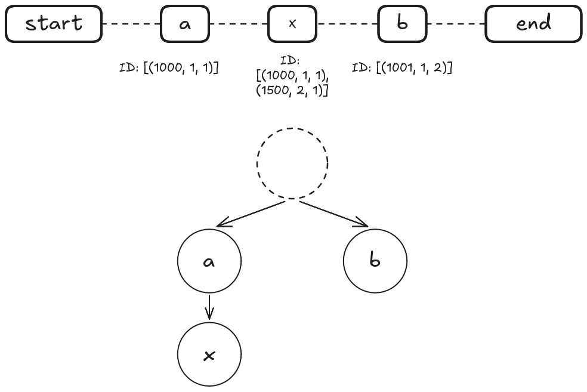

За счёт такого подхода к вставке Logoot лишён необходимости рекурсивного обхода конфликтного участка, достаточно лишь вставки в упорядоченную структуру, которая выполняется за `O(log n)`, отсюда, собственно, и название.

Кроме того, архитектурно Logoot меньше завязан на tomstone-ах, и более гибок в плане их устранения, что позволяет эффективнее оптимизировать память.

### LSEQ
Логическое продолжение Logoot, предлагающее другой алгоритм выбора позиции на уровне. Во-первых, LSEQ удваивает диапазон, из которого выбираются числа, для каждого нового уровня. Во-вторых, предлагаются стратегии `boundary+` и `boundary-`, оптимизирующие различный характер редактирования текста (более частая вставка в конец для `boundary+` и более частая вставка в начало для `boundary-`). Сами стратегии отвечают за то, к какой из границ диапазона будет склоняться выбор числа на уровне. В реальных системах данные стратегии чередуются на уровнях, чтобы сгладить эффект обоих стилей редактирования.

### YATA (Yjs)
Все предыдущие алгоритмы были подвержены так называемой interleaving problem (можно перевести как "проблема перемешивания") --- при разрешении конфликтов вставки, осмысленные блоки текста, написанные обоими сторонами конфликта перемешивались в нечитаемый вид, теряя не только последовательность внутри предложения, но и смысл отдельных слов. Попытка внести ясность в разрешение конфликтов была предпринята в алгоритме YATA, на котором основана одна из двух самых популярных библиотек CRDT --- Yjs.

Сам YATA основан на RGA (Replicated growable array), каждый символ в котором представлен самодостаточным путём в дереве. Вставка символа в YATA задаётся как `insert(id, originLeft, originRight, value)`. Это очень похоже на WOOT, но сам алгоритм разительно отличается. Рассмотрим пример, когда в пустую строку два пользователя конкурентно пытаются записать строки "mom" и "dad". В локальных версиях документа, каждый символ указывает на своего соседа справа и слева, левый сосед для крайнего левого символа (m или d) является указателем на начало строки, правый сосед для крайнего правого символа является указателем на конец строки.

```rust
  Block {
    id: (replicaId, seqNr)     — идентификатор символа
    originLeft: ID или null    — сосед слева в момент вставки
    originRight: ID или null   — сосед справа в момент вставки
    value: символ или null     — сам символ (null, если tombstone)
  }
```

Выполняя конкурентную вставку, алгоритм, точно как и WOOT рассматривает "спорный" участок, проверяя наличие каких-либо посторонних (конкурентных) записей. Однако спорным фактически является только левая граница конкурентных записей, так как только эти два символа конкурируют за право вставки в данное место. Все последующие символы через `originLeft` связаны с левым пограничным символом и уже не претендуют на весь участок, так как в любом случае идут после граничного символа. Поэтому разрешение конфликта на деле сводится к разрешению конфликта пограничных символов, а весь блок текста, который они за собой тянут, пойдут вместе с ним по тем ссылкам, которые уже определены в пограничных символах. Так, в примере, конкурирующими символами являются только символы "m" и "d" на участке между "start" и "end". Пусть в результате разрешения конфликта через лексикографическое сравнение идентификаторов этих символов "победил" символ "m". В таком случае он встанет на "спорный" участок, утащив за собой все связанные символы через `originRight`. После всех этих символов расположится "проигравший" символ "d", который потянет за собой всю строку "dad". Таким образом мы получим строку "momdad".

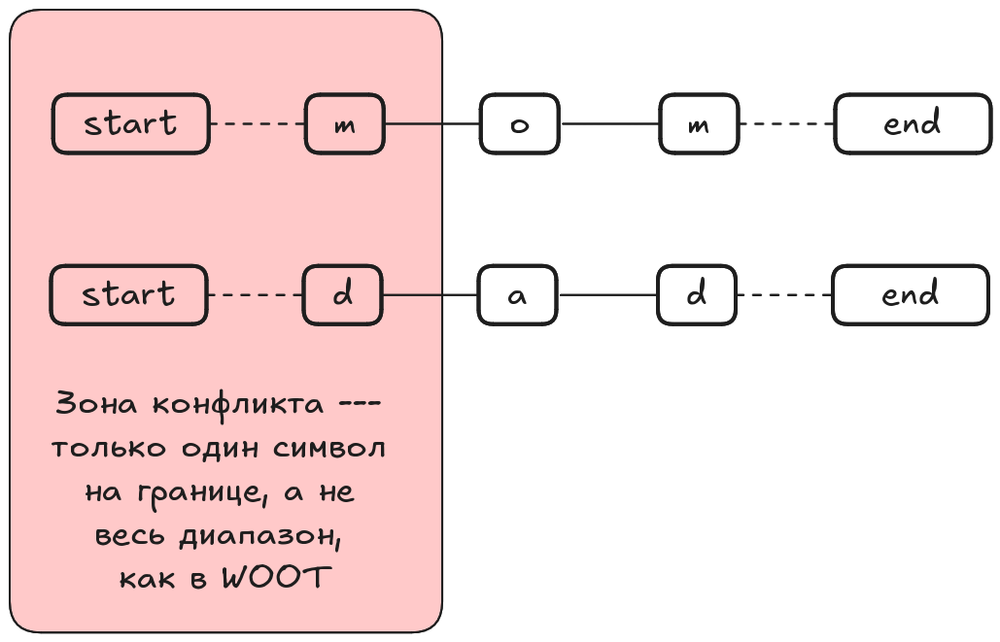

Такая жёсткая связка позволяет сохранить смысл сообщения обоих участников конфликта при конкурирующей вставке на одно и то же место.

Ещё одним преимуществом этого алгоритма являются более слабые требования к сети. YATA требует лишь гарантии надёжной доставки (reliable network, все отправленные сообщения рано или поздно будут доставлены) и не выдвигает никаких требований к порядку доставки.

## Peritext: Rich text 
Довольно долго не существовало формализованного алгоритма для редактирования Rich text (текста с форматированием). Существовали решения на основе OT, однако они требовали описания 64 функций трансформации и нуждались в наличии сервера-арбитра, задающего каноничный порядок операций. Решения на основе CRDT существовали как Open-source проекты без доказательной базы и какой-либо формализации. Первым опубликованным, формально описанным алгоритмом являлся Peritext --- исследовательский проект компании Ink&Switch. Работа вышла в 2021 году.

Peritext абстрагирует слой форматирования от слоя Plain text-а. Он не задаёт какой-то конкретный CRDT, который управляет Plain text-ом, однако привязывается к `opId` --- идентификатору символа в этом CRDT. 

```
  {
    action: "remove",
    opId: "5@alice",
    removedId: "2@alice"
  }
```

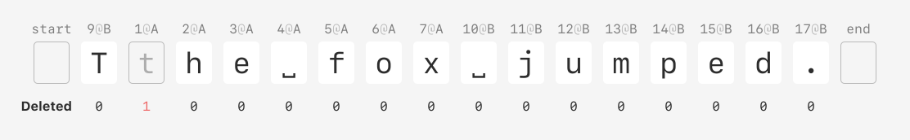

Само форматирование в Peritext представляет собой span (можно перевести как "диапазон форматирования") с концами **между** символами. Peritext определяет по два якоря между каждыми символами: "до разрыва" (сразу после левого символа) и "после разрыва" (сразу перед правым символом). Такая необычная структура позволяет определять, будет ли новый текст отформатирован, если добавить его прямо в конец диапазона.

В каждой якорной точке может (но не обязан) храниться op-set --- множество всех операций добавления/удаления форматирования. Если в точке не задан op-set, то в ней действует тот же op-set, что и в ближайшей предыдущей точке, в которой он задан. Таким образом происходит экономия памяти, не требуется на каждый символ дублировать один и тот же набор операций.

Когда применяется, например, addMark(start, end, "bold"):
1. В точке start — берём op-set из ближайшей предыдущей известной точки, добавляем туда эту операцию.
2. Проходим все промежуточные точки внутри диапазона [start, end), где op-set уже явно задан (не ⊥) — и добавляем туда эту же операцию.
3. В точке end — если там ещё нет явного op-set, инициализируем его как копию ближайшего предыдущего без этой новой операции (потому что действие операции здесь заканчивается).

```
  {
    action: "addMark",
    opId: "18@A",
    start: { type: "before", opId: "5@A" },
    end:   { type: "before", opId: "17@B" },
    markType: "bold"
  }
```

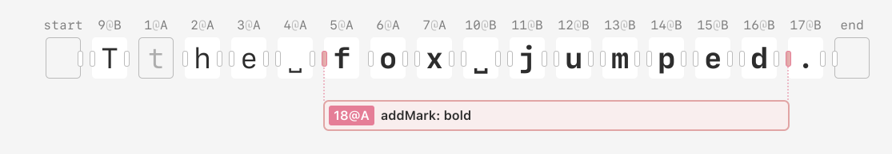

Конкурентность не разрешается в момент вставки, она разрешается в момент отображения. В момент вставки операция форматирования просто добавляется в множество op-set. На этапе отображения для каждого типа операции форматирования применяется правило LWW по идентификатору операции (`opId`): сравниваются все операции одного типа, и побеждает операция с наибольшим `opid`.

Несмотря на свою производительность, Peritext не лишён недостатков. Прежде всего, это демонстрационное решение, в котором, как заявляют сами авторы, решения приняты с расчётом на простоту и производительность. Однако это не является неустранимым недостатком: **сжатое представление** последовательности символов, применяющееся в Automerge для оптимизации потребления памяти, может быть также внедрено в Peritext.

Неустранимым недостатком является ограниченность на inline-форматировании. Peritext описывает алгоритм коллаборативного редактирования текста в рамках одного абзаца и не предусматривает блочную структуру документа.

Peritext являлся исследовательским проектом, который первым формализовал коллаборативное редактирование Rich-Text. Исследование оказалось успешным, и его наработки были перенесены в библиотеку Automerge 2.2 (вторая самая популярная библиотека для CRDT).

## Итоги
За 20 лет индустрия пришла от поиска удачной функции трансформации к бесконфликтным реплицируемым типам данных. Прогресс в эффективности и возможностях до сих пор не стоит на месте. Активно ведутся работы по уменьшению потребления памяти CRDT: Automerge 3.0 уменьшил потребление памяти с 700 Мб для документов в старой версии до 1.3 Мб, а в 2025 году Мартин Клеппман совместно с Джозефом Джентлом разработали алгоритм Eg-walker, основанный на git-подобном графе операций, также снижающим итоговое потребление памяти.

Отдельным направлением исследования является межблочное форматирование. Peritext сознательно ограничен inline-разметкой внутри одного параграфа. Вопрос о переносе принципов совместного редактирования текста на блочную структуру документа остаётся открытым.

Свой вклад в развитие совместного редактирования вносят и "невидимые программисты" --- ИИ-агенты. Если люди печатают инкрементально, побуквенно, периодически исправляя изменения, то ИИ-агент --- это участник с принципиально другим стилем редактирования. Агенты испольщуют массовые замены целых блоков текста, а иногда и файлов. Все рассмотренные алгоритмы проектировались под человека, но оптимальны ли они при работе с агентами? Это лишь предстоит выяснить.

## Источники
1. https://arxiv.org/pdf/2207.02502
2. https://arxiv.org/pdf/1708.04754 
3. https://inria.hal.science/inria-00109039v1/document
4. https://inria.hal.science/inria-00108523v1/document
5. https://www.researchgate.net/profile/Pascal-Molli/publication/40497572_XWiki_Concerto_A_P2P_Wiki_System_Supporting_Disconnected_Work/links/0deec5208fddb6fde7000000/XWiki-Concerto-A-P2P-Wiki-System-Supporting-Disconnected-Work.pdf
6. https://inria.hal.science/inria-00432368/document
7. https://hal.science/hal-00921633/document
8. https://www.researchgate.net/publication/310212186_Near_Real-Time_Peer-to-Peer_Shared_Editing_on_Extensible_Data_Types
9. https://www.inkandswitch.com/peritext/
