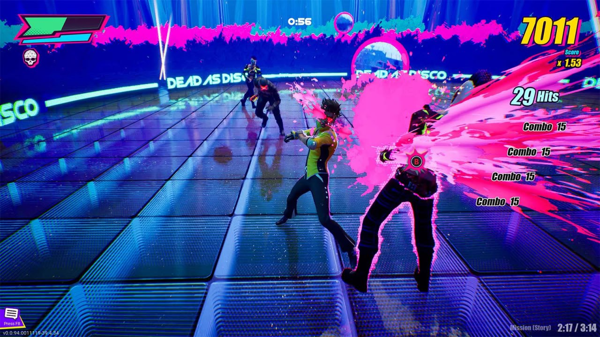
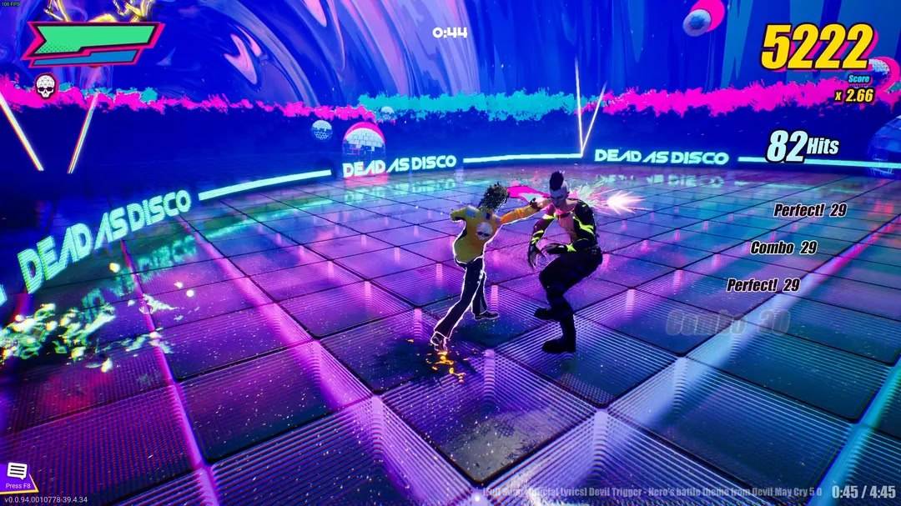
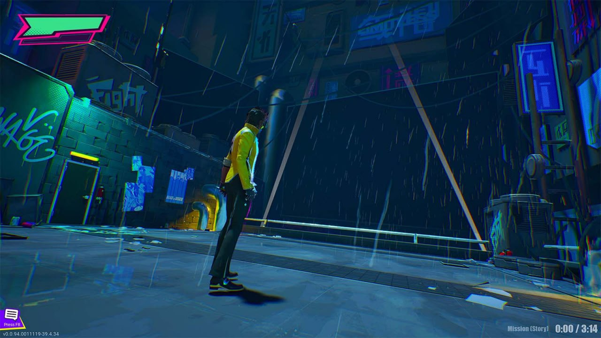
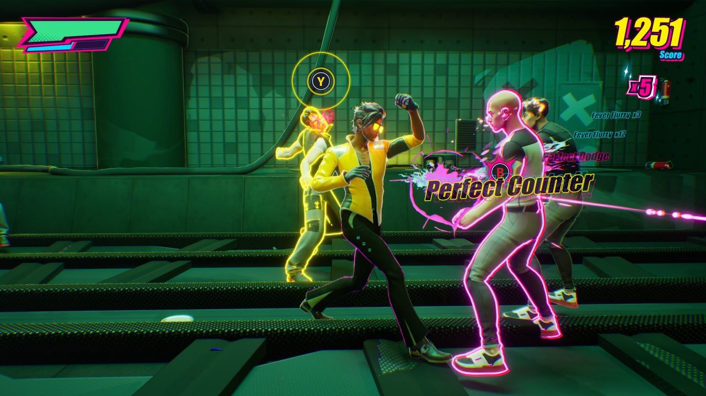

Не могу пройти мимо новых ритм-игр. Их и так немного выходит, последней на моей памяти была Metal: Hellsinger. 

А сейчас на столе демка "Dead as Disco".  Это beat'em up в неоновом стиле какого-нибудь Hi-Fi Rush с боёвкой, которая является чем-то средним между Sifu и Devil May Cry.

Из плюсов, конечно, визуал. Критической недоработкой со стороны разработчиков стало отсутствие фоторежима или его подобия. Яркие неоновые цвета, обилие эффектов, вспышек, так и хочется сделать сочный кадр.
Боёвка простая, но видно, что она не в конечной форме. Много комбо и приёмов ещё в разработке. Все шансы повторить шедевральную боевую систему Sifu.

Ключевая особенность игры — музыка и ритм (логично, это же ритм-экшен). Судя по dev diary, разработчики хорошо постарались над синхронизацией ударов и музыки. Первый (и пока единственный) уровень под музыку диско играется просто великолепно.
Но это не всё: разработчики реализовали возможность максимально просто загружать свои треки. Достаточно загрузить mp3 файл и указать BPM. И всё, этого уже достаточно, чтобы синхронизировать движения персонажа с ритмом музыки.

Минусы тоже есть — это демка. Причём достаточно ранняя. Доступен лишь early alpha build первого уровня и "свободный" режим с парочкой арен. Противников всего 5-7 типов, приёмов мало. Усугубляет ситуацию то, что разработчики не дают практически никакой информации о времени разработки: ни роадмапа, ни даты релиза. Всё, что сейчас имеется в FAQ — это обещание "что-то выпустить в 2025 году". Собственно, в мае 2025 вышла эта демка. И больше ничего.

Подытожив, игра отправляется в вишлист, а я подписываюсь на новостную рассылку Brain Jar Games. Советую всем любителям ритм-экшенов.

