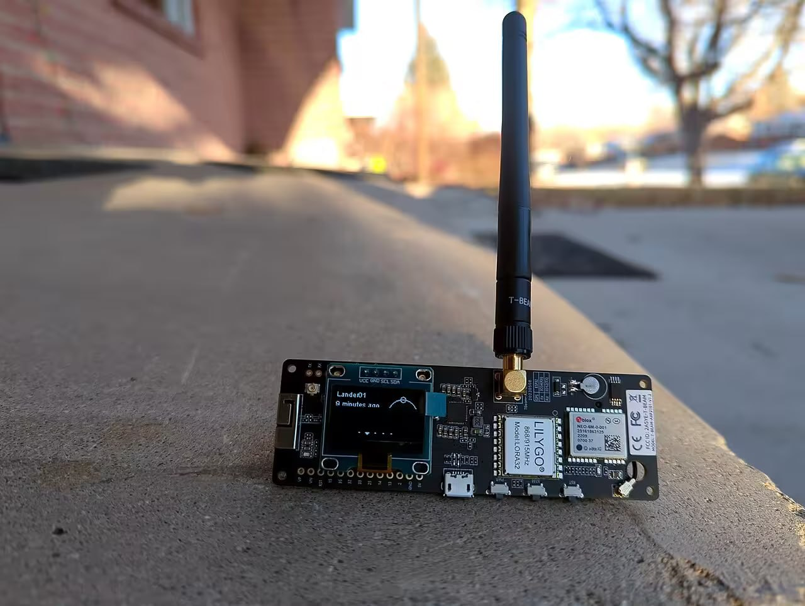

Это тестовый пост — заглушка, чтобы проверить, что список, страница поста, теги и RSS работают как надо. Здесь будут появляться настоящие заметки: что-то про код, что-то про жизнь.



Картинка выше лежит прямо рядом с этим постом (`hello-world/diagram.png`) и подключена относительным путём — Astro сама оптимизирует такие изображения при сборке, без дополнительной настройки.

## Пример кода

Чтобы убедиться, что подсветка синтаксиса работает из коробки:

```ts
function greet(name: string) {
	return `Привет, ${name}!`;
}
```

## Пример формулы

Заодно проверим LaTeX: инлайн-математика вроде $E = mc^2$ должна отрендериться прямо в строке, а блочная —

$$
\int_0^\infty e^{-x^2} \, dx = \frac{\sqrt{\pi}}{2}
$$

отдельным блоком по центру.

## Что дальше

- Заменить этот пост первым настоящим
- Написать что-нибудь про [распределённые системы](/about)
- Не забыть проставить теги

> Черновик — правьте смело.
