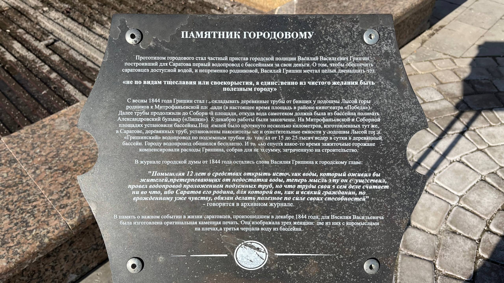

Вот такая интересная история попалась мне на глаза во время последней прогулки. 

История об альтруизме и добродетельности человека  по отношению к тому месту, в котором он живёт.

Теперь, кстати, стало ясно происхождение некоторых бассейнов и фонтанов в Саратове — это пережитки первого водопровода!
