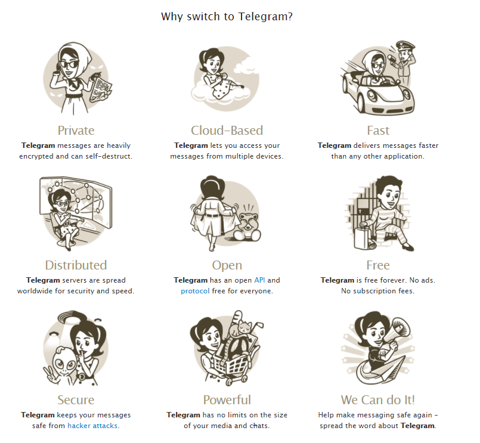
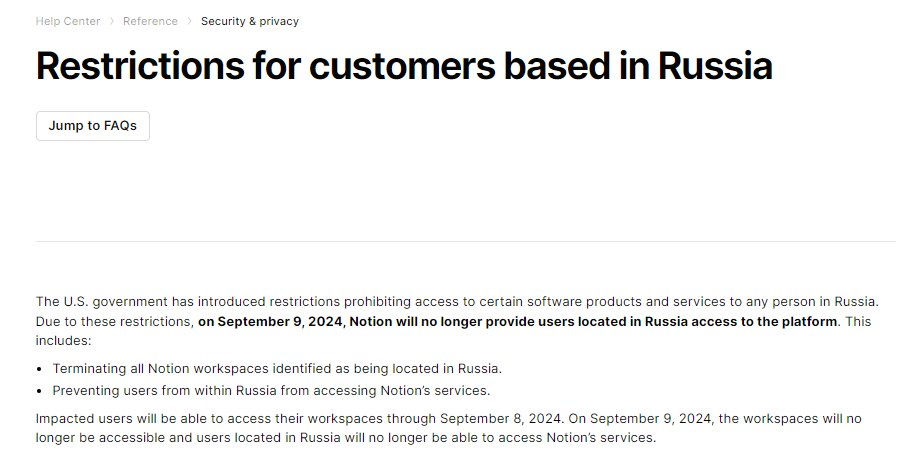

## Введение
Думаю, ни для кого не секрет, что Telegram, в течение последних десяти лет стал самым популярным и народным мессенджером в России. Связано это, в том числе, с его простотой, устойчивостью к блокировкам и безопасностью. Да, тейк про безопасность достаточно спорный, однако в общественном сознании мессенджер закрепился именно таким. Площадка росла, пользователи прибывали. Постепенно, она начала трансформироваться и двигаться в сторону социальной сети. Появились публичные каналы.

В самом Telegram я довольно давно, но канал завёл поздно, лишь год назад. Это было связано с тем, что раньше я не считал нужным делиться чем-то с незнакомыми людьми и как-то освещать себя в интернете. В этом просто не было ни нужды, ни желания. Однако с ростом числа знакомств, с расширением моих интересов и активностей, такая потребность появилась. Я завёл свой канал, в котором сначала рассказывал о том, что нравится мне, о недавних интересных событиях в своей жизни, а затем начал делиться своими мыслями и вещами, которые меня волнуют и беспокоят. 

Ключевым правилом для меня было и остаётся полная добровольность подписки. Я никогда никого не призывал и не буду призывать подписываться, никогда не отслеживал, кто на меня подписался, а кто отписался, в отличие от некоторых моих знакомых, которые каждому отписавшемуся начинают писать в личку и спрашивать, что случилось, почему ты так поступил или, что ещё хуже, тихо обижаться. Крепостное право отменили в 1861, подписчики к ~~помещику~~ контентмейкеру вроде не прикреплены, поэтому такая тревожность для меня выглядит странно. Тем не менее, я могу упомянуть в разговоре о том, что я о чём-то писал в своём канале или что-то выложил.

## Почему Telegram?
Когда-то все сидели в ЖЖ и было модно иметь свой блог в ЖЖ, когда-то все сидели в ВК и было модно иметь своё сообщество в ВК, когда-то все сидели в Telegram и было модно иметь свой канал в Telegram. Кроме того, у Telegram очень низкий порог входа: для создания канала достаточно нажать две кнопки, придумать название и уже можно публиковать контент. Кроме того, каналы в Telegram отображаются на главной странице, так что от нового поста интересующего вас человека отделяет один клик мыши или один тап пальцем --- человеку не нужно совершать никаких дополнительных действий, чтобы увидеть контент.

Ну и конечно, странно было бы заводить канал там, где никто его не увидит, поэтому выбирать надо было платформу, на которой сидит больше всего целевой аудитории. В моём случае это был Telegram.

## Два стула
Павел Дуров не смог удержаться от своего желания делать социальные сети. Поэтому Telegram, который изначально задумывался как мессенджер, стал дрейфовать в сторону социальной сети. Проблема в том, что фундаментально он задуман как **мессенджер**. Поэтому мессенджер, который пытается казаться социальной сетью стал выглядеть странно: 
- Комментарии под постами сделаны как отдельная непонятная группа, в которую надо вступать;
- Общей ленты сообщений нет;
- Нет возможности посмотреть подписки конкретного человека;
- Каналы, группы и личные чаты отображаются единообразно и совершенно неотличимо друг от друга, кроме как маленькой иконкой;

Ну и самое ужасное --- мессенджер задуман для обмена сообщениями между **уже известными** тебе контактами. Социальная сеть создана для **знакомства** и общения в том числе **с незнакомыми** людьми. В этом Telegram, как ни пытался, так и не преуспел --- случайно наткнуться на что-то необычное, но схожее с твоими интересами просто функционально невозможно.

В этом, к слову, было преимущество <u>раннего</u> ВКонтакте --- он позволял через ленту рекомендаций наткнуться на пост совершенно рандомного паблика из 10 человек или на пост человека со схожими интересами. Социальная сеть действительно выполняла свою ключевую задачу --- **связывала людей между собой**. В дальнейшем рекомендательная лента превратилась из точки знакомства в доску объявлений с ценами на публикацию, а ВКонтакте потерял своё самое сильное преимущество.

Ситуацию точно не улучшило введение подписки Telegram Premium. Картинка выше, с преимуществами перехода в Telegram, активно форсилась в сети в момент появления подписки. Недовольство объяснимо: продукт, позиционировавшийся ранее как бесплатный, внезапно ввёл платную подписку. С одной стороны, мотивация компании понятна: заработок с платформы отсутствовал, а для обеспечения качественного продукта, работники должны что-то есть, а для этого им нужно чем-то платить. С другой стороны, "*бесплатность*" Telegram оказалась прямым обманом аудитории. И было очевидно, что развитие подписки продолжится.

Так и оказалось: реакции, истории, функции для бизнеса, AI-функции --- всё это пошло под нож и оказалось в платной подписке. Новая функция форматирования текста, добавляющая в сообщения заголовки, таблицы, встроенные (inline) медиафайлы также оказалась только в платной подписке. Дошло до абсурда, некоторые пользователи не могли отформатировать текст как цитату без подписки, что ранее было доступно в базовой версии. Однако, вроде как, это оказалось багом, а цитаты всё же можно отправлять без подписки. Но, как говорится:
> Осадочек то остался!

Но самым больным выстрелом себе в ногу для Telegram оказались **лимиты символов**. Текстовое сообщение в канале для простого пользователя ограничено **4096** символами, сообщение с медиафайлами --- **1024** символами. Для осознания того, как это мало, пролистайте вверх до картинки с преимуществами Telegram. Два абзаца, следующие за этой картинкой состоят из **1113** символов. Сформулировать объёмную мысль, подкреплённую медиафайлом в таких условиях, лично для меня, почти невозможно. Поэтому придётся либо разделять медиафайлы и текст на два разных сообщения, семантически разрывая единое сообщение, либо раскошелиться на подписку, в которой чуть больше, но всё ещё мало символов: **8192** и **4096** соответственно. Тот же ВКонтакте имеет лимит около 16 тысяч символов, а также отдельный формат статей с ограничением до 100 тысяч символов. В Telegram также существует формат статей --- блог платформа Telegraph, которая позднее отделилась от него. И вот, казалось бы, пользуйся на здоровье и публикуй свои эссе на 100 тысяч символов. Но тут надо посмотреть на проблему под другим углом.

## Кто владеет данными в Интернете? 
Облачные сервисы как-то совершенно незаметно и естественно вошли в нашу жизнь и очень прочно там обосновались. Все социальные сети, мессенджеры, игры, большинство хранилищ и редакторов изображений --- всё это находится в облаке. Будет глупо утверждать, что у этого нет своих преимуществ --- они есть. Однако в контексте данной статьи целесообразно рассмотреть один ключевой недостаток. 

Хранение данных на облаке означает хранение данных на сервере поставщика услуг. Если вы читаете пользовательское соглашение, то знаете, что оператор может в любой момент по какой-нибудь надуманной (или не очень) причине остановить предоставление услуг пользователю.

Показательна история платформы для заметок Notion, случившаяся в 2024 году. Из-за санкций США, запрещающих предоставление цифровых услуг россиянам, платформа сообщила об отключении и удалении всех рабочих пространств пользователей, находящихся в России. Безусловно, компания заранее предупредила своих пользователей о прекращении работы и позволила выгрузить личные данные, но что если бы такого не произошло? Всё, что пользователи копили годами в таких сервисах может быть одномоментно уничтожено из-за внешних событий, на которые сами пользователи повлиять не могут. А даже если экспорт есть, то что делать с огромным архивом json/xml файлов? Все ли сервисы позволяют импортировать такие данные? Нет. Как минимум, потому что такая функция просто невостребована, как максимум, из-за отсутствия единого формата файла.

Получается интересная история: хранение данных, которые производим, мы доверяем компаниям, которые в любой момент могут лишить нас их из-за внешних факторов. 

Кроме того, знаете ли вы, что происходит с вашими данными на серверах поставщика услуг? Вы знаете, как они хранятся? Насколько надёжную инфраструктуру предоставляет провайдер? Не знаете. А что делать, если оператор недобросовестно относится к вашей конфиденциальности и не выстраивает безопасную инфраструктуру или даже добровольно передаёт данные третьим лицам? Ни одна компания не защищена на все 100% от кибератак. С определённой периодичностью в новостях всплывают новости о новой утечке данных какой-нибудь крупной компании. А потом данные о ваших покупках, адресе проживания, ФИО, а иногда даже паспортных данных и номерах телефонов оказываются в чужих руках.

Проблема владения контентом широко распространена в наше время, и я обязательно посвящу этой проблеме отдельную статью, но сейчас стоит вернуться к Telegram.

С 2025 года доступ к Telegram в России начал ограничиваться. Это побудило ещё раз задуматься о том, что доступ к созданному мной контенту в какой-то момент может быть потерян. Вместе с ограничением функционала, который вынесен в платную подписку, я задумался о создании собственного блога.

## Своё пространство в цифровой среде
Я долго думал о том, что именно мне надо, ведь блог --- это только про обмен мыслями, переживаниями, идеями и опытом с людьми в асинхронном формате через Интернет в текстовом виде. Но это точно было не всё, что я хотел. Посетив несколько десятков персональных страниц людей в интернете, я составил себе в голове примерную картину того, что я хочу от проекта. **Я хочу своё пространство**.

Представьте себе павильон с небольшими окошками, закутками и комнатками, каждая из которых разительно отличается от соседних всем, чем только можно: оформлением, содержанием, владельцем и правами доступа. Например, слева, в небольшой комнате вас встречает добродушный фотограф, который рад впустить к себе, показать всё, чем он увлекается, а также позволить порисовать на своём холсте; справа, за окном, стоит строгий дизайнер, чьё пространство поражает красотой и самобытностью, но он не пускает вас во внутрь, а лишь позволяет наблюдать через стекло, на котором в уголке на табличке выгравированы контакты для связи.

Такое же пространство хочу и я. Своё место в Интернете, в которое любой желающий может свободно зайти и познакомиться с тем, что интересно мне, почитать мои мысли, посмотреть на то, чем я занимаюсь. А я, в свою очередь, как и фотограф, предоставлю возможность повзаимодействовать с тем, что находится вокруг. Конечно, такое пространство должно быть в том числе и песочницей. Местом, где я смогу делиться с друзьями и незнакомцами всякими приколами и необычностями. Ну и визиткой со ссылкой на портфолио на главной странице, чтоб... круто было!

## POSSE

Возвращаясь к блогу, я понимал, что просто создать его и начать постить только туда недостаточно. Пользователю нужно заходить, тыкать на страницу блога, проверять, что вышло что-то новое. А это новое может и не выйти, я ведь не новостное издание с регулярной публикацей. В общем, заходить на сайт --- это совершать лишние (для кого-то) клики, что в современном мире роскошь (с чем я не согласен, но, к сожалению, вынужден мириться). Всё это решает RSS-лента, которая незаслуженно ушла в небытие, уступив место тем же социальным сетям. У меня в блоге есть RSS, потому что ей пользуюсь я и мои знакомые, и я считаю, что RSS должны вернуться в нашу жизнь.

Изучая IndieWeb, я наткнулся на **POSSE --- Publish on (your) site, syndicate elsewhere**. Это я и представлял у себя в голове, просто не был знаком с этим принципом. Суть заключается в том, чтобы оригинал контента находился на вашем собственном ресурсе, а копии распространялись по другим платформам, удобным читателям, со ссылкой на оригинал. Так, потребители контента всегда будут получать его там, где им это удобно, а производитель всегда будет иметь полные права владения над ним, без передачи третьим лицам и риска утраты. Владение и управление контентом должно быть в руках его создателя.

Эта идея пришлась мне по душе и я планирую распространять контент именно по такой схеме. Ключевым требованием перед релизом сайта являлось автоматическое распространение контента по другим платформам в презентабельном виде. Не планирую отказываться от этого.

## Что дальше?

Пока у меня есть идеи, как развивать это пространство, да и блог точно не окажется заброшенным. Я очень хочу, чтобы оно осталось маленьким, домашним и интересным, прежде всего, мне самому, и очень желательно, другим людям.
