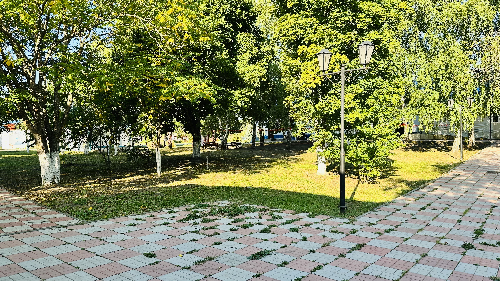
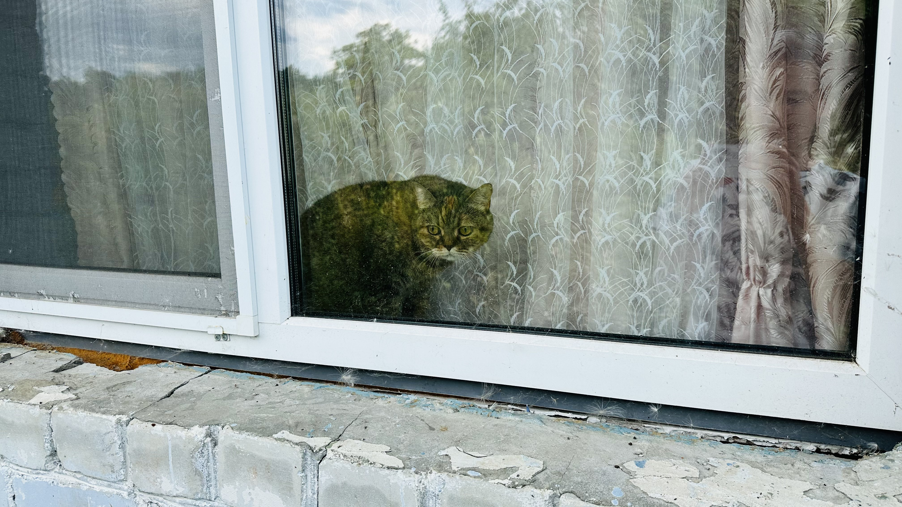
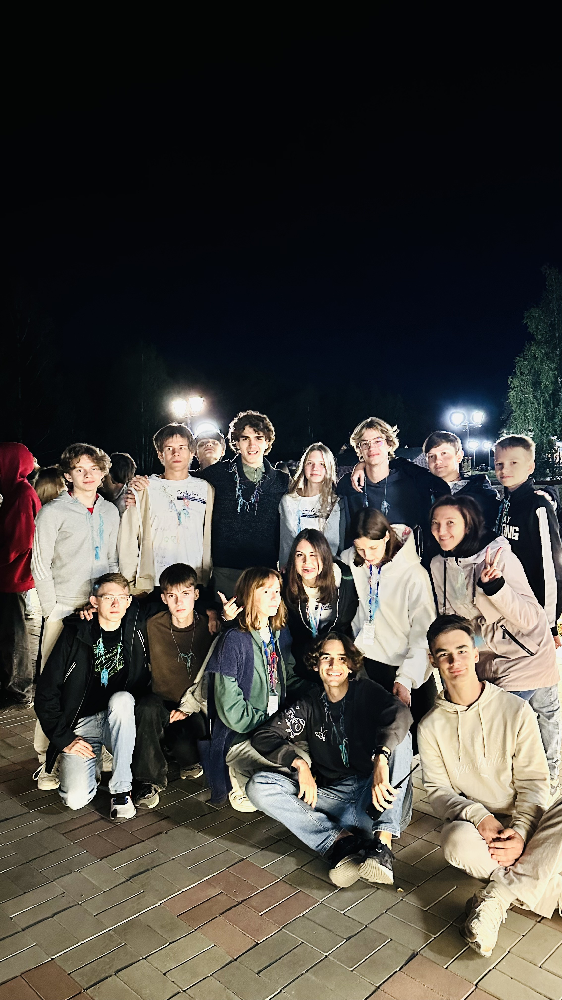
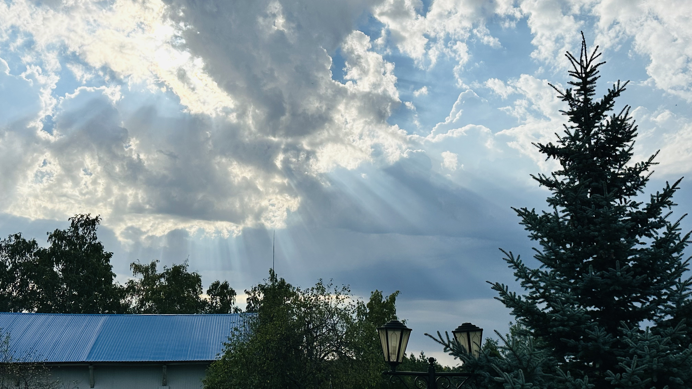
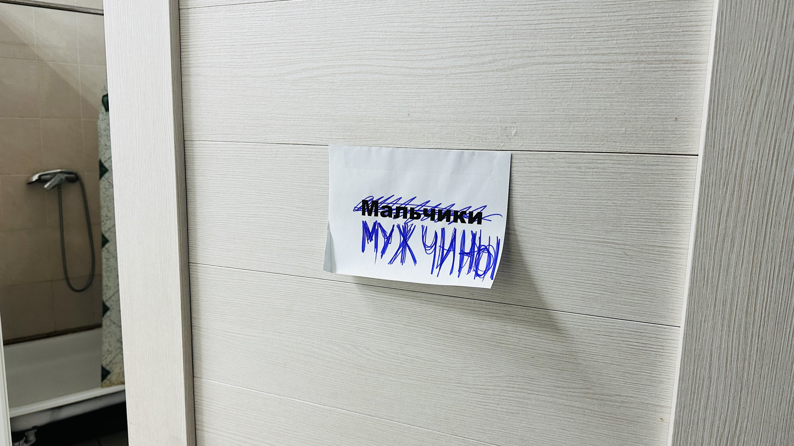
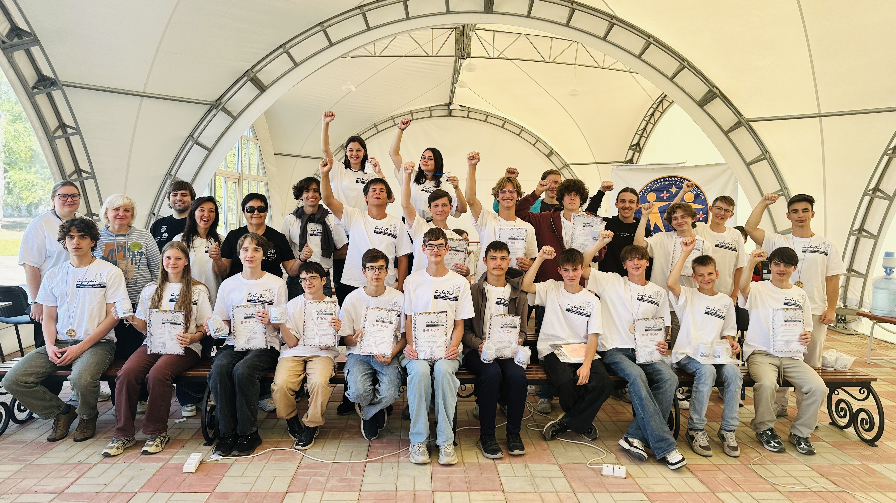
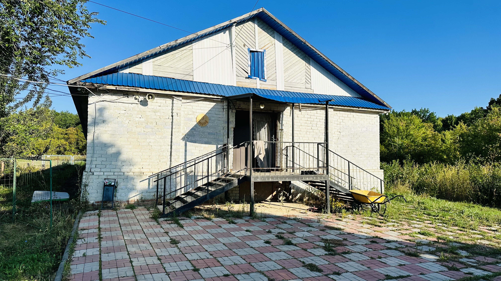
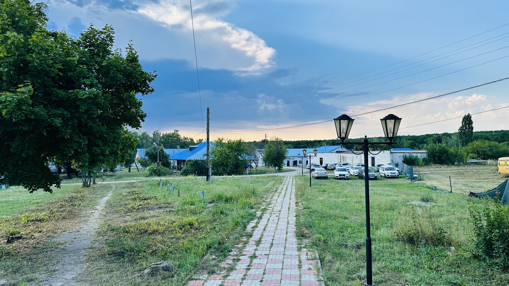
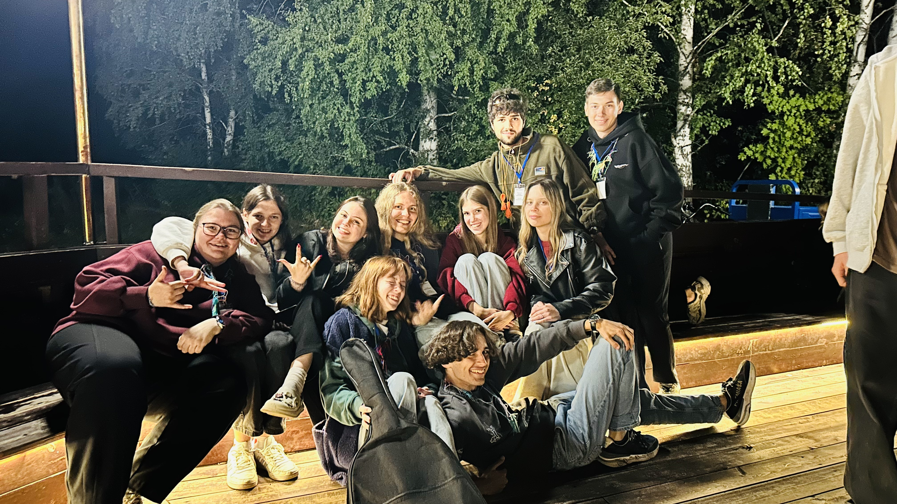
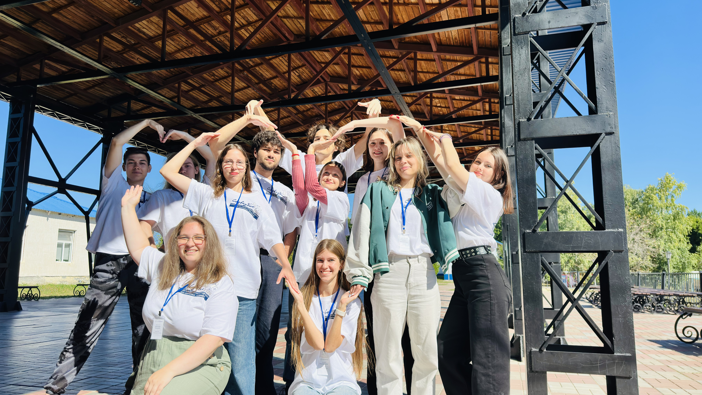

Второй год я езжу вожатствовать в "Созвездие" --- летнюю школу для одарённых детей. Попадание сюда для меня, никогда не бывавшего в детских лагерях и никогда не бывавшего вожатым, кажется максимально противоестественным. Несмотря на сомнения, я всё же согласился на эту авантюру в июне 2025 года, в августе первый раз надел бейджик вожатого, а теперь поехал второй раз.

*В этой статье я постараюсь описать прошедшие события, эмоции и переживания, а также записать и запомнить то, как прошла эта во всех смыслах необычная смена. Будет немного сумбурно. Ну и ладно.*

## Что такое "Созвездие"?

"Созвездие" может казаться детским лагерем, но им не является. Это летняя школа: 4 часа в день школьники слушают лекции от преподавателей, делают домашние задания, а оставшееся время тратят на участие в мероприятиях. Тем не менее, я уже привык называть это место лагерем, хотя, как было сказано ранее, оно скорее "продукт лагересодержащий".

Смена "Созвездия" длится около 10 дней и проходит ежегодно в конце августа. Все участники делятся на 12 отрядов по направлениям: математика, информатика, физика, химия, журналистика, лингвистика (русский язык), лингвистика (английский язык), лингвистика (немецкий язык), биология, география, история, литература. В каждом отряде присутствует как минимум один научный руководитель и вожатый. Научные руководители читают лекции и занимаются со школьниками, в то время как вожатые не дают заскучать и присматривают за детьми. Среди преподавателей есть лекторы ВШЭ, СГУ и других ВУЗов. Параллельно со школьниками в "Созвездии" проводятся сборы Центра олимпиадной подготовки программистов СГУ, на которых студенты готовятся к соревнованиям по алгоритмическому программированию.

## Переезд
"Созвездие" проводилось в разных лагерях, но традиционным местом проведения считается лагерь "Дубки" в Саратове. В этом году, однако, провести там смену не представлялось возможным из-за закрытия детских лагерей на Кумысной поляне властями Саратовской области. Это было серьёзной проблемой, не только потому что "Дубки" были привычным, отработанным местом проведения смены, но и потому что лагерь находится достаточно близко к городу. Согласитесь, что не каждый лектор будет готов трястись на автобусе полтора часа в сторону какого-нибудь лагеря в области, чтобы прочитать лекцию школьникам, а затем трястись столько же обратно.

Но решение было найдено, и смена была организована в лагере имени Володи Дубинина. С ним удалось договориться на проведение смены в привычное для "Созвездия" время --- конец августа. И хотя трансфер для приглашённых лекторов удалось обеспечить, а дети не оказались без занятий, многие гости, которые часто посещали "Созвездие" до Дубинина не доехали (лагерь находится в часе езды от Саратова), из-за чего план-сетка оскуднела.

## Бесполезность подготовки
Во второй раз ехать было, конечно, намного проще чем в первый, потому что ты понимаешь, что тебя ждёт и к чему готовиться. План-сетка мероприятий год от года особо не меняется, всё одно и то же с поправками на свободные слоты и юбилеи отрядов. 

Но парадокс "летней школы" всё ещё влиял на меня. Хочется ведь подготовиться к смене: придумать, чем можно занять ребят, какие мероприятия провести, как организовать отряд. Я искал информацию, что-то записывал, что-то придумывал. А потом это всё оказалось просто ненужным, потому что это не летний лагерь. Отряд информатиков, к примеру, вожатым которого я был, словно не требует вообще никакой подготовки. Ребята приезжают на 10 дней решать контесты, слушать лекции и писать олимпиады, с которых их периодически вытаскивают на обед какие-то непонятные люди с бейджиками вожатых. 

На самом деле это очень сильно деморализует, потому что ты готовишься быть наставником, формировать командный дух, направлять ребят и помогать им, а в результате ощущаешь свою бесполезность. Кажется, что ты нужен только для того, чтобы а) гонять детей на завтрак/обед/ужин и б) гонять детей на линейку и объяснять, почему отряду нельзя не прийти на торжественное открытие/закрытие, на которое приезжают гости, содействовавшие проведению смены в этом году. Особенно сильно это ощущается, когда сравниваешь свой технический отряд информатиков и какой-нибудь гуманитарный отряд лингвистов/журналистов.

Конечно, вожатые на практике занимались много чем ещё и выполняли важную связующую роль между отрядом и руководством.

## Когда я ем, я глух и нем
Кто бы мог подумать о том, что главным разрушителем расписания будет столовая!

В "Дубках" столовая представляла из себя огромный зал с большим числом столов и стульев, в котором могли разместиться все отряды одновременно. Не считая сервировки столов, приём пищи занимал никак не более двадцати минут у всего лагеря. Дети приходили, садились за стол, на котором уже стояли все блюда, ели, а потом относили посуду и уходили. Быстро, чётко, слаженно.

В Дубинине столовая была в два раза меньше, чем количество детей в лагере. Поэтому как бы не хотелось, обед приходилось разбивать на две смены. Кроме этого, некоторые блюда были на выбор (например, на салат можно было взять свежие огурцы или кабачковую икру, а на второе можно было выбрать между, например, картофельным пюре и овощным рагу), из-за чего дети должны были сами подойти к стойке раздачи, выбрать блюдо, а затем сесть за стол. Представьте себе, как долго 240 детей будут продвигаться в такой системе. Любой приём пищи затягивался на час, если не больше. Это сильно било по расписанию, мероприятия сдвигались или урезались просто из-за того, что всем нужно поесть.

## Планёрки и сон
Отбой в лагере происходит в 23:00, но касается он только детей. Вожатые продолжают бодрствовать и идут на планёрку, чтобы порефлексировать на день уходящий и обсудить день грядущий. Планёрки у нас длятся столько, сколько надо, и по опыту прошлого года могу сказать, что могли они быть и до двух часов ночи, и до трёх.

В этом году, однако, все планёрки были достаточно быстрыми и освобождались мы не позднее часу ночи. Обусловлено это было, как мне кажется, двумя вещами:

1) БОльшая часть вожатых уже была знакома с планом-сеткой по опыту прошлых лет и быстро схватывала и предлагала идеи.
2) Из-за переезда, отсутствия юбилеев отрядов, план-сетка сжалась до ключевых мероприятий.

Хотя планёрка заканчивалась достаточно поздно, а подъём как всегда был по расписанию в 8:00, некоторые вожатые не расходились и оставались на поболтать и просто провести вместе время после напряжённого дня. Особо стойкие расходились в четыре, а когда и в пять часов утра. Я был в их числе.

На удивление, два часа сна давали больший заряд бодрости, чем четыре или более. Я не мог нормально проснуться, если ложился во втором часу ночи, но прекрасно себя чувствовал и бодро поднимался, когда ложился в четыре-пять часов утра. Я думал об этом парадоксе и связывал его с тем, что за небольшой период сна (пару часов) организм не успевает уйти в фазу глубокого сна, из которого труднее просыпаться и остаётся в фазе быстрого сна. Из-за этого просыпаться становится проще. Полагаю, такой режим не очень полезен для организма, но, пока я молод, я готов пойти на такую жертву ради воспоминаний.

Да, ночные посиделки с вожатыми, наверное, запомнятся больше всего. Это время знакомства и сближения, невероятных историй и задушевных разговоров. Ну не узнал бы я про похождения китайских императоров в любое другое время. И не увидел бы связанные в форме сердечка кроссовки в одном из отрядных домиков. Ночью всё ощущается иначе, потому что ночь --- непривычное для нас время, обычно мы ночью спим. А непривычное запоминается гораздо охотнее.

## Блокнот
В этом году в кармане я носил небольшой блокнот и ручку. Они оказались намного удобнее, чем телефонные заметки. Последние надо открывать, искать нужную запись, а телефон может разрядиться в течение дня. В блокноте все записи сразу на виду, его быстро открыть и быстро начать писать. *И форматирование текста можно выбрать любое!!!* Для "Созвездия", когда надо всё вспоминать на бегу, такая пара оказалась очень удобной.

Я давно думаю о том, чтобы в обычной жизни носить с собой блокнот для небольших заметок и напоминалок, потому что телефон в кармане является слишком сильным отвлекающим фактором. К тому же тестовый 10-ти дневный режим такого формата оказался достаточно успешным.

## Природа
С какого-то момента жизни, который мне трудно точно установить, мне очень нравится природа. Её звуки и, в особенности, её тишина. Когда не слышно ничего постороннего кроме, быть может, шелеста листвы, звуков насекомых и пения птиц. В городе, даже рядом с ним, такого не испытать --- звуковое загрязнение слишком сильное. А вот в часе езды, на окраине небольшого села, в окружении лесного массива --- вполне. И это неописуемо прекрасно!

После суетного дня, после стресса и беготни, просто сесть и послушать звуки природы --- лучшее чувство, которое можно испытать. Это моментально успокаивает и очищает голову от любых мыслей. Здорово, что у меня была такая возможность.

## Вожатство
Смена в прошлом году была наполнена множеством разных событий, которые заставили меня, мягко говоря, понервничать. К середине смены я ходил в таком состоянии, что окружающие просто боялись за моё здоровье. В этом году я был готов к самым неожиданным событиям.

Но их не произошло. Честное слово, каждый день я просыпался с мыслью *"Ну вот сегодня точно что-то да должно произойти"*. Но нет, всё было спокойно: все номера ставились, все ребята из отряда занимались своими делами и всегда были на месте. Мы нашли общий язык и хорошо провели смену. Я хоть и удивлялся и боялся худшего, в душе всё равно радовался тому, что всё хорошо.

## Проблема социализации

На эту проблему я обращаю внимание довольно давно и одним "Созвездием" она не ограничивается. Здесь я лишь убедился в её существовании. В "Созвездие" приезжают дети, которые занимают места на олимпиадах различного уровня. Некоторые из них ездят на смену каждый год, что лишь подтверждает их навыки.

Некоторые из них испытывают проблемы с социализацией. Они замкнуты, зажаты и словно оторваны от происходящего вокруг. Им комфортно исключительно в той среде, которая для них привычна --- листочек, ручка и условие задачи. Они не участвуют в командных играх и конкурсах, а если приходится, то занимают пассивную роль и минимально взаимодействуют с остальной командой.

Особенно часто такая проблема встречается в технических областях: математика, физика, информатика, геометрия.

Мне невероятно печально видеть человека, который очень хорош в своей сфере, но который не может поддержать простейший разговор. Гения, который может решить сложнейшую задачу, но который совершенно не задумывается о своём окружении и быте. Человека, который на вопрос "Что тебе запомнилось за день?" может вспомнить только условия сегодняшних задач.

Олимпиады таким ребятам открывают дороги в любой ВУЗ, в любую компанию, обеспечивают им хорошее будущее. Но осознают ли они сами то, какие возможности им открывает их талант? В полной ли мере они используют весь этот потенциал? Пообщавшись с людьми, знакомыми с олимпиадной сферой, я выяснил, что далеко не всегда.

Всё описанное выше ни в коем случае таких людей не характеризует с негативной стороны. Я искренне поражаюсь их талантам и рад, что он может помочь им самореализоваться. Но мне грустно от того, что социализации, которая не менее важна, уделяется меньше внимания. "Созвездие" всеми силами помогает таким ребятам, устраивает общелагерные мероприятия, организует досуг после лекций. А мне самому приятно, что я могу внести свою, пусть и небольшую, но лепту, в этом нелёгком деле.

## Война идеологий 
Эта смена запомнится мне настоящей войной двух идеологий. Такая действительно произошла и длилась чуть ли не половину смены. Место действия --- дискотека.

В Дубинине нам на протяжении всей смены помогали местный диджей и старший вожатый. На первой общей планёрке, когда мы с ними познакомились, они, как минимум у меня, создали впечатление знающих дело людей, которые "6 смен подряд отработали" (цитата). Они рассказывали про то, как развлекали детей на обычных сменах, про дискотеки и прочее. Ну мы это послушали, приняли к сведению.

А вот то, что произошло на следующий день на дискотеке, в страшном сне представить тяжело. В этом году на смену "Созвездия" приехали только старшие отряды (от 14 лет). И специально для них диджей начал включать отборные нейрослоп треки из тиктока. Мне тяжело описать словами качество такого контента. Более того, ни один трек не играл дольше двадцати секунд. На фоне всего этого фарса крутились либо такие же нейрослопные картинки, либо филлерные видеоролики, не имеющие никакого отношения к музыке. Вишенкой на торте оказался микрофон в руках главного вожатого, который глубоким басом пытался "раскачать" детей, подпевая нейрослопным трекам. Одновременно странно, уморительно и неприятно было слышать, как этот бас перепевал интро из "Леди баг". Один из детей дал самое, как мне кажется, удачное описание происходившего:

> Диджей просто подключил свой тикток к аппаратуре и листал ленту.

Мы не знали, как к этому относиться, потому что столкнулись с таким впервые. Это было чем-то совершенно противоположным тому, как обычно проходили дискотеки в "Дубках". "Каноничной" песней дискотеки "Созвездия" считалась "Ночь" Андрея Губина. Сравнивать её с игравшим "Сикс-севен" Газана просто бессмысленно.

Дети, к нашему счастью, тоже не оценили такой перформанс, и мы начали пытаться объяснить молодому (он был младше всех вожатых) диджею, что же нам всё таки нужно, и почему его плейлист не заслуживает места даже в перебивках между выступлениями. Это удавалось с трудом, непонятные аудио-визуальные "выкидоны" продолжались вплоть до середины смены. Но в конце концов всё же удалось сформировать плейлист истинного "Созвездия".

Этот интересный случай заставил задуматься о самоидентичности "Созвездия" и его ценностях.

## Моё "Созвездие"
Чем же для меня является "Созвездие" и почему оно так тянет вернуться назад? Тяжело ответить однозначно. Прежде всего, тут я не чувствую себя скованным рамками. Я и в повседневной жизни стараюсь быть открытым и свободным человеком, но это словно требует определённых усилий. А тут нет. Вокруг люди, которые точно так же, как и ты просто самовыражаются, творят и дурачатся, совершенно не думая о том, что о них подумают. Потоки бесформенной энергии выплёскиваются из людей и встречаются с другими такими же потоками энергии. Тут нет места негативу и конфликтам, а если что-то такое происходит, то быстро испаряется в общей позитивной обстановке. Здесь я нашёл схожих по духу людей, совершенно разных, но одновременно так похожих друг на друга.

> Лимина́льность (англ. liminality, от лат. līmen — порог, пороговая величина) --- физиологический, неврологический или метафизический термин, обозначающий "пороговое" или переходное состояние между двумя стадиями развития человека или сообщества.

"Созвездие" есть лиминальное ~~пространство~~ место. Место, в котором нет статусов и времени. Все словно вновь чувствуют себя детьми. И это здорово. Я много переживаю о том, что в полной мере не прочувствовал, не прожил какой-то отрезок своей жизни, но если даже оно и так, "Созвездие" с лихвой мне его компенсирует.

